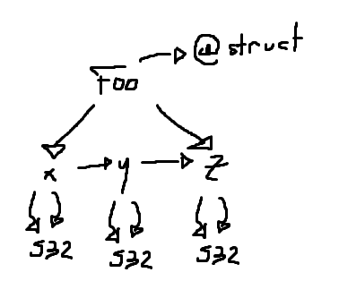

# Metawho?
Metadesk lets you create structured text files, like C code or HTML, driven by
information you supply in Metadesk data structures. It's useful in automating
some types of 'metaprogramming' or 'document building' tasks. You can use
Metadesk to generate code for serializing networking messages, or to generate
HTML for your blog.

This is a sample written in the Metadesk format.
```c
@struct Foo:
{
  x: S32,
  y: S32,
  z: S32,
}
```

To you, this might look like a variation on a C struct declaration. Metadesk,
however, does not recognize any such concept. Metadesk sees a tree of nodes, like this.



Consider this minimal example which goes through each top level declaration,
listing its tags and children.

```c
int main(int argument_count, char **arguments)
{
    MD_String8 example_code = MD_S8Lit("@struct Foo:\n"
                                       "{\n"
                                       "  x: S32,\n"
                                       "  y: S32,\n"
                                       "  z: S32,\n"
                                       "}\n\n");
    MD_Node *code = MD_ParseWholeString(MD_S8Lit("Generated Test Code"), example_code);
    
    /* iterate through each top-level node */
    for(MD_EachNode(node, code->first_child))
    {
        printf("  - %.*s\n", MD_StringExpand(node->string));

	/* print the name of each of the node's tags */
	for(MD_EachNode(tag, node->first_tag))
	{
            printf("    - Tag %.*s\n", MD_StringExpand(tag->string));
	}

	/* print the name of each of the node's children */
	for(MD_EachNode(child, node->first_child))
	{
            printf("    - Child %.*s\n", MD_StringExpand(child->string));
	}
    }
    
    return 0;
}
```
output:
```
  - Foo
    - Tag struct
    - Child x
    - Child y
    - Child z
```
The `MD_StringExpand` and `MS_S8Lit` macros are necessary because Metadesk
stores strings as a pointer and a length, rather than storing only a pointer
and relying on null termination, as standard C literals and the CRT assume.

The example above serves well to introduce you to the API calls, but doesn't make evident
the tree structure that MD_Nodes occupy. Imagine if you replaced the outermost for
loop with a call to this function:
```c
void recurse(MD_Node *node, int indent)
{
    for(int i = 0; i < indent; i++) printf(" ");

    char *kind;
    switch(node->kind) {
    case(MD_NodeKind_Label): kind = "Label"; break;
    case(MD_NodeKind_Tag): kind = "Tag"; break;
    case(MD_NodeKind_File): kind = "File"; break;
    }
    printf("- %s %.*s\n", kind, MD_StringExpand(node->string));

    for(MD_EachNode(tag, node->first_tag)) recurse(tag, indent + 2);
    for(MD_EachNode(child, node->first_child)) recurse(child, indent + 2);
}
```

If you supplied 0 as the initial indentation, the output would be like this:
```
- File `DD Parsed From "Generated Test Code"`
  - Label Foo
    - Tag struct
    - Label x
      - Label S32
    - Label y
      - Label S32
    - Label z
      - Label S32
```
Compare this to the tree diagram from before; they should match up 1:1 (modulo the File node).

Metadesk has helpers built in for common formats, like C structure declarations.
You could have replaced that outermost for loop in the original example with this
one, instead of the call to `recurse`.
```c
    for(MD_EachNode(node, code->first_child))
    {
        if(MD_NodeHasTag(node, MD_S8Lit("struct")))
        {
            MD_OutputTree_C_Struct(stdout, node);
        }
    }
```

Then the output would be
```c
typedef struct Foo Foo;
struct Foo
{
S32 x;
S32 y;
S32 z;
};
```
## Details

### Sets
The colon marks the beginning of a set, and the set can be delimited
by a variety of brackets and parentheses, or even newlines.
```c
Foo: {1 2 3}
Bar: (4 5 6)
Baz: [0, 100)
Baw: (-100, 25]
Something: 1 2 3 // terminated by newline
```
The delimiters that were used are encoded in the `MD_Node`s using
the `MD_NodeFlags` enum.

### Tags
Tags themselves may have Labels as children nodes.
```c
@struct @serialize @ui @member_string_function("StringFromFooMember")
Foo:
```

### Errors
The location that the MD_Node came from in the file is recorded inside of it,
simply call `MD_NodeError(MD_Node *node, MD_String8 str)`.
